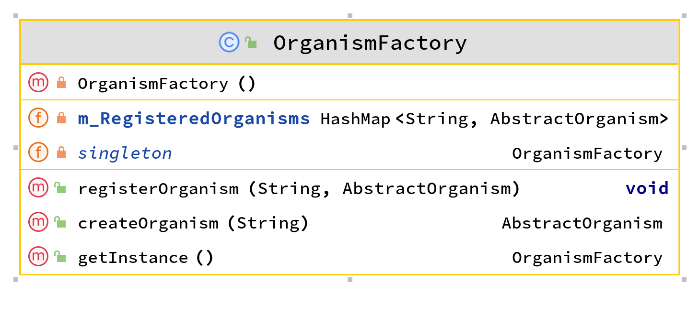

# Life Simulator

Life Simulator is an interactive ecosystem simulation of the complex relationships between organisms in various ecosystems, including reproduction, death, hunger, and dynamic weather patterns. The ecosystem simulation is an innovative, immersive, and hands-on experience in which users can customize parameters like population sizes, species interactions, and weather patterns to simulate specific ecosystems and study the effects of different variables. The aim of Life Simulator is to bring the wonders of the natural world to users' fingertips and contribute to a greater understanding of our interconnected ecosystems.
It's currently on version **0.5.0**.

## Installation

Run `./gradlew build` from the project root directory to build it. The jar can be found in the build/libs directory.

## Testing

The programs tests can be run by using the `./gradlew cucumber` command from the project root directory.

## Usage

Combining these two commands will build and run the program :

`
./gradlew build
`

`
java -jar build/libs/animal-simulation-project-0.5.0.jar
`

Run it from the projects root directory.

### Terminal Flags and Using them

Since terminal flags are a very soon to be implemented feature we'll detail how to use them with this program. The flags won't be noticed if more then one argument is passed, as such the quotation marks are very important and allow the program to identify the flags properly.
Terminal Flags are run in this program by string, as such they should be attached to the end of the run command like so:

> java -jar (path/to/jar) "terminal-flags-go-in-here"

Multiple flags can be used at the same time, however, per handler they are checked from left to right. As such if there's two grid_width flags then only the rightmost one will matter. The following is an example of what using multiple flags might look like:

> java -jar (path/to/jar) "--Grass_count 10 --Rabbit_count 10 --grid_width 10 --grid_height 20"

We have 3 different terminal flags currently:

* --(organism_name)_count #

Example of Usage: --Rabbit_count 33
This flag spawns an initial amount of rabbits in the simulation, the value is capped to 9999999. Negative values don't work.
It also only works with currently implemented animals, those being:
Rabbit

* --grid_width #

Example of Usage: --grid_width 53
This flag sets the initial grid width for the simulation, the value is capped to 9999999. Negative values don't work.

* --grid_height #
 
Example of Usage: --grid_height 63
This flag sets the initial grid height for the simulation, the value is capped to 9999999. Negative values don't work.

* --days_amount #

Example of Usage: --days_amount 4
This flag sets how many days the simulation will last, the value is capped to 9999999. Negative values don't work.

* --steps_per_day #

Example of Usage: --steps_per_day 10
This flag sets how many time steps will occur per simulation day, the value is capped to 9999999. Negative values don't work.

## Program Structure

### TerminalFlagHandler

The TerminalFlagHandler depends on the **Organism Factory** to properly create organisms within the grid for it's initialOrganismCountFlagHandler. It is an abstract class but there are currently 2 concrete instances of it.
These concrete instances are the grid size handler, the initial organism count handler, the Days per run handler, and the Time Steps Per Day handler which all do as their names implies, they work by taking the internal values of the request and modifying it to make and save the changes. They use regex to pick out the flags and know when and how they're supposed to make those changes.

This component is based upon the Chain of Responsibility design pattern from [oodesign.com](https://www.oodesign.com/chain-of-responsibility-pattern)

### OrganismFactory

The OrganismFactory is a singleton which registers products, organisms, into itself via an instance and a string. It then creates a new object from the internal instance when asked to create one with the required string ID. 

It is based upon the Factory-pattern design pattern from [oodesign.com](https://www.oodesign.com/factory-pattern)
## License

[MIT](https://choosealicense.com/licenses/mit/)
