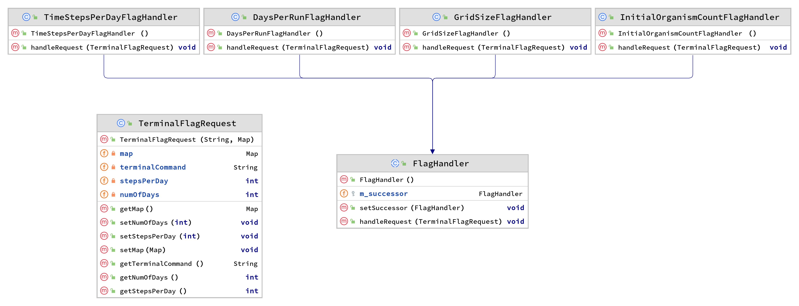

# Life Simulator

Life Simulator is an interactive ecosystem simulation of the complex relationships between organisms in various ecosystems, including reproduction, death, hunger, and dynamic weather patterns. The ecosystem simulation is an innovative, immersive, and hands-on experience in which users can customize parameters like population sizes, species interactions, and weather patterns to simulate specific ecosystems and study the effects of different variables. The aim of Life Simulator is to bring the wonders of the natural world to users' fingertips and contribute to a greater understanding of our interconnected ecosystems.

## Installation

Run `./gradlew build` from the project root directory to build it. The jar can be found in the build/libs directory.

## Usage

This command will build and run the jar from the intellij :

`
./gradlew build && java -jar build/libs/animal-simulation-project-prototype.jar
`

Run it from the projects root directory.

### Terminal Flags and Using them

Since terminal flags are a very soon to be implemented feature we'll detail how to use them with this program.
Terminal Flags are run in this program by string, as such they should be attached to the end of the run command like so:

> java -jar (path/to/jar) "terminal-flags-go-in-here"

Multiple flags can be used at the same time, however, per handler they are checked from left to right. As such if there's two grid_width flags then only the rightmost one will matter.
We have 3 different terminal flags currently:

* --(animal_name)_count #

Example of Usage: --Rabbit_count 33
This flag spawns an initial amount of rabbits in the simulation, the value is capped to 9999999. Negative values don't work.
It also only works with currently implemented animals, those being:
Rabbit

* --grid_width #

Example of Usage: --grid_width 53
This flag sets the initial grid width for the simulation, the value is capped to 9999999. Negative values don't work.

* --grid_height #
 
Example of Usage: --grid_height 63
This flag sets the initial grid height for the simulation, the the value is capped to 9999999. Negative values don't work.

## Program Structure

### TerminalFlagHandler

This section contains information on how the TerminalFlagHandler works internally and how to implement it into a program.

## License

[MIT](https://choosealicense.com/licenses/mit/)
