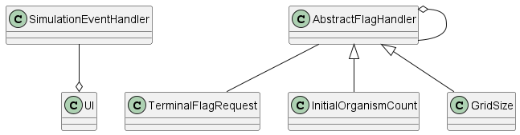
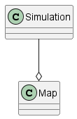
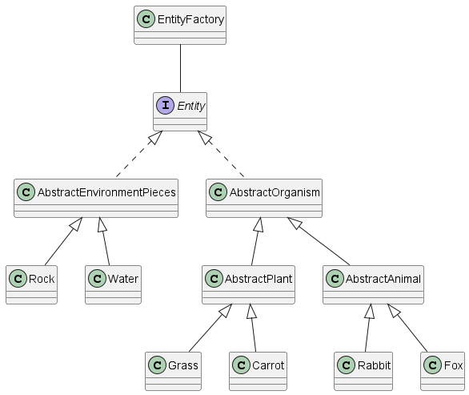

# Architecture

## Overview

This document outlines the architecture of our project. Each section represents a separate package within the program.

## UI

The UI package contains everything needed for a user to interact with the program. The UI class contains the main method for the program which simply runs a simulations when called. It contains an instance of the SimulationEventHandler class which handles anything that happens in the simulation that the UI might need to output. It acts a bridge between the UI and the simulation.

The AbstractFlagHandler class is a template for flag handlers which will check for flags when the program is run. An instance of AbstractFlagHandler contains another instance of the same class which is the successor to it in a chain of responsibility. The InitialOrganismCount class will check for the flag giving the initial organism count while GridSize will do the same for the size of the map in the simulation. TerminalFlagRequest simply represents the whole set of terminal flags given as a single object.

## Simulation

The architecture of the Simulation package is rather simple. The simulation class contains all of the logic relating to changing the environment at specified time intervals. It's the main driver of the program. Simulation also contains an instance of the Map class which represents where various living and nonliving things are in the environment.

## Entities

The Entities package contains classes relating to both living and nonliving things that may occupy space in the simulated environment. The Entity interface is an interface to allow the Map class from the Simulation package to be able to contain a given class. AbstractEnvironmentPieces implements Entity and is an abstract class representing nonliving things, and Rock and Water are concrete extensions of this class.

AbstractOrganism implements Entity and is an abstract class representing living things. AbstractPlant extends AbstractOrganism and represents plants in the environment. Grass and Carrot are concrete extensions of AbstractPlant. AbstractAnimal extends AbstractOrganism and represents animals in the environment. Rabbit and Fox are concrete extensions of AbstractAnimal.

Finally, EntityFactory is a class that creates an instance of Entity based on certain specifications. It can create a direct instance of any subclass of Entity that has previously been registered with it. EntityFactory uses the singleton design pattern, so there will only ever be one entity factory in the program.

